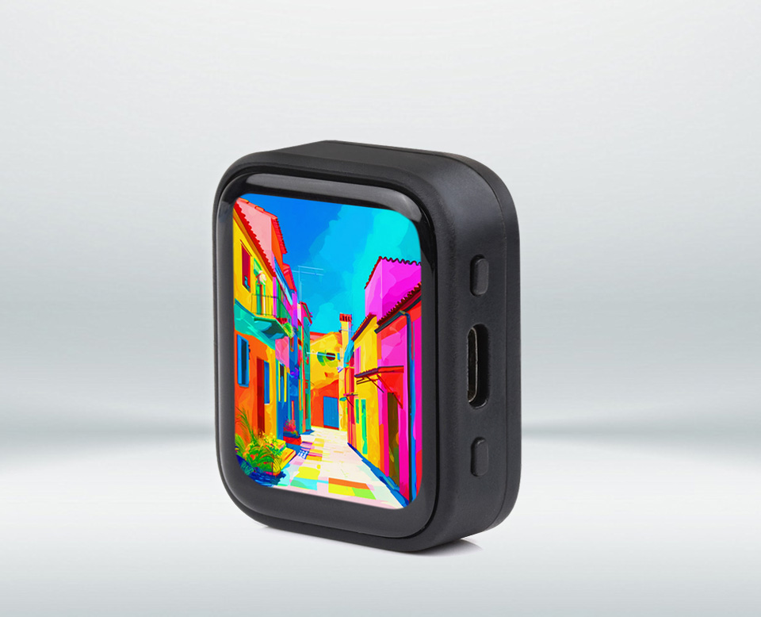

<div align="center">
  <h1>ESP32-S3-Touch-AMOLED-1.8</h1>
  <p><strong>集成 1.8 英寸 368 x 448 QSPI AMOLED 触摸屏的 ESP32-S3 开发板</strong></p>
  <p>
    <a href="https://github.com/waveshareteam/ESP32-S3-Touch-AMOLED-1.8/actions/workflows/examples.yml"></a>
    <a href="https://components.espressif.com/components/waveshare/esp32_s3_touch_amoled_1_8"></a>
    <a href="LICENSE"></a>
  </p>
  <p>
    <a href="README.md">English</a> ·
    <a href="https://www.waveshare.com/esp32-s3-touch-amoled-1.8.htm">🌐 商品页</a> ·
    <a href="https://docs.waveshare.com/ESP32-S3-Touch-AMOLED-1.8">📚 官方文档</a> ·
    <a href="https://github.com/waveshareteam/ESP32-S3-Touch-AMOLED-1.8/releases">📦 固件发布</a> ·
    <a href="examples/esp-idf/">🧩 ESP-IDF 示例</a> ·
    <a href="examples/arduino/">🔧 Arduino 示例</a>
  </p>
  <a href="https://www.waveshare.com/esp32-s3-touch-amoled-1.8.htm">
    
  </a>
</div>

---

## 产品概览

开发板集成 ESP32-S3、1.8 英寸 368 x 448 AMOLED 触摸屏、microSD、ES8311 音频编解码器、板载麦克风输入、RTC、PMU 和 IMU。ESP-IDF 示例优先使用在线托管的 `waveshare/esp32_s3_touch_amoled_1_8` BSP 组件，便于客户从统一的组件结构开始开发。

本仓库提供原版与 V2 两种硬件对应的 ESP-IDF 和 Arduino 示例、源码构建固件包、
工厂恢复镜像及开发文档。

## 硬件概览

| 功能 | 器件 / 接口 |
| --- | --- |
| 主控 | ESP32-S3 |
| 显示 | 1.8 英寸 368 x 448 QSPI AMOLED |
| 原版显示 / 触摸 | SH8601 + FT3168 电容触摸 |
| V2 显示 / 触摸 | CO5300 + CST820 电容触摸 |
| 电源管理 | AXP2101 PMU |
| 实时时钟 | PCF85063A RTC |
| 运动传感器 | QMI8658 六轴 IMU |
| 音频 | ES8311 编解码器、板载麦克风输入和扬声器功放 |
| 存储 | microSD（SDMMC） |
| 板级支持 | 托管组件 <code>waveshare/esp32_s3_touch_amoled_1_8</code> |

> [!NOTE]
> V2 板实际使用的触摸芯片是 CST820。部分捆绑 Arduino 源码为兼容驱动保留了
> <code>Arduino_CST816x</code> 系列或 API 名称，这些代码标识不代表 V2 板搭载的是
> CST816。

> [!IMPORTANT]
> 本仓库暂未包含板级原理图。CI 只验证源码兼容性和固件打包，不能替代对引脚、
> PSRAM、USB、显示、触摸、音频和传感器的实机验证。

## 快速开始

推荐使用 ESP-IDF v5.5.x 或 v6.0.x，目标芯片为 `esp32s3`：

```bash
cd examples/esp-idf/00_board_check
idf.py set-target esp32s3
idf.py build
idf.py -p PORT flash monitor
```

将 `PORT` 替换为开发板串口。

`00_board_check` 是最适合首次运行的串口自检示例，会打印芯片、Flash、PSRAM、BSP 能力、显示分辨率、I2C、SD 和音频能力。需要图形界面验证时，再运行 `00_bsp_quickstart`。

## 固件获取

每个成功的 CI 构建都会生成可刷写固件包，并上传到
[Build Examples workflow](https://github.com/waveshareteam/ESP32-S3-Touch-AMOLED-1.8/actions/workflows/examples.yml)。
正式版本发布后，可从
[GitHub Releases](https://github.com/waveshareteam/ESP32-S3-Touch-AMOLED-1.8/releases)
下载版本化固件；最近提交的逐示例固件请使用 CI 构建产物。

每个固件包包含 <code>manifest.json</code>、<code>flash_args.txt</code>、
Windows/Linux 刷写脚本和 <code>bin/</code> 目录。仓库中的
[Firmware](Firmware/) 为工厂/恢复镜像，不属于 CI 源码构建产物。详细边界和
使用方法见 [固件说明](docs/FIRMWARE.md) 与
[Release 工具](releases/README.md)。

## 示例

### ESP-IDF

ESP-IDF 示例按照从简单到复杂的顺序组织：

| 目录 | 用途 |
| --- | --- |
| [00_board_check](examples/esp-idf/00_board_check/) | 板级与 BSP 能力自检 |
| [00_bsp_quickstart](examples/esp-idf/00_bsp_quickstart/) | BSP、显示、触摸、LVGL、亮度和 SD 快速验证 |
| [01_project_template](examples/esp-idf/01_project_template/) | 最小托管 BSP 项目模板 |
| [02_hello_world](examples/esp-idf/02_hello_world/) | ESP-IDF Hello World |
| [03_nvs_counter](examples/esp-idf/03_nvs_counter/) | NVS 持久化计数 |
| [04_freertos_tasks](examples/esp-idf/04_freertos_tasks/) | FreeRTOS 任务与队列 |
| [05_gpio_io](examples/esp-idf/05_gpio_io/) | GPIO 输入输出回环 |
| [06_gpio_interrupt](examples/esp-idf/06_gpio_interrupt/) | GPIO 中断 |
| [08_i2c_tools](examples/esp-idf/08_i2c_tools/) | I2C 扫描 |
| [09_sdmmc](examples/esp-idf/09_sdmmc/) | SDMMC/FAT 文件读写 |
| [10_wifi_station](examples/esp-idf/10_wifi_station/) | Wi-Fi Station |
| [12_i2s_codec](examples/esp-idf/12_i2s_codec/) | ES8311 扬声器播放 |
| [13_display_colorbar](examples/esp-idf/13_display_colorbar/) | AMOLED 色条显示 |
| [14_lvgl_demo_v9](examples/esp-idf/14_lvgl_demo_v9/) | LVGL v9 控件演示 |

`90_` 范围保留给板级硬件诊断：

| 目录 | 用途 |
| --- | --- |
| [90_axp2101_pmu](examples/esp-idf/90_axp2101_pmu/) | AXP2101 PMU 诊断 |
| [91_pcf85063_rtc](examples/esp-idf/91_pcf85063_rtc/) | PCF85063A RTC 诊断 |
| [92_qmi8658_imu](examples/esp-idf/92_qmi8658_imu/) | QMI8658 IMU 诊断 |

完整说明见 [examples/README.md](examples/README.md) 和 [docs/EXAMPLES_GUIDE.md](docs/EXAMPLES_GUIDE.md)。

### Arduino

Arduino 示例按实际显示和触摸硬件分为两套，并分别携带匹配的捆绑库：

| 示例集 | 显示 / 触摸 | 第一方示例数 |
| --- | --- | ---: |
| [原版](examples/arduino/examples/) | SH8601 / FT3168 | 16 |
| [V2](examples/arduino-v2/examples/) | CO5300 / CST820 | 10 |

两套示例均覆盖显示初始化、绘图、RTC、LVGL、IMU、SD 和 ES8311 音频。
原版示例还包含 Wi-Fi 分析、时钟、AXP2101 数据、动画和 SquareLine 风格的
LVGL 工程。捆绑库自身携带的上游示例不属于本产品 CI 的构建范围。

## 文档

- [商品页](https://www.waveshare.com/esp32-s3-touch-amoled-1.8.htm)
- [官方产品文档](https://docs.waveshare.com/ESP32-S3-Touch-AMOLED-1.8)
- [入门指南](docs/GETTING_STARTED.md)
- [示例指南](docs/EXAMPLES_GUIDE.md)
- [项目结构](docs/PROJECT_STRUCTURE.md)
- [CI 说明](docs/CI.md)
- [固件说明](docs/FIRMWARE.md)
- [Release 工具](releases/README.md)
- [贡献指南](CONTRIBUTING.md)
- [支持说明](SUPPORT.md)
- [第三方软件说明](THIRD_PARTY.md)

## CI

GitHub Actions 的 `Build Examples` 工作流构建第一方 ESP-IDF 和 Arduino
示例：ESP-IDF 覆盖 v5.5.5 与 v6.0.2，Arduino 同时覆盖
`examples/arduino` 与 `examples/arduino-v2`，使用 Arduino-ESP32 core
3.3.11。

PR 和分支推送只构建受影响的第一方示例；捆绑库变更会重建对应 Arduino
示例集，工作流、发现脚本和 release 打包脚本变更会重建两个框架。
标签推送与手动 `all` 运行会执行完整矩阵。成功构建会上传源码构建的可刷写
固件包，仓库内的工厂固件仅作为恢复/出厂镜像保留，不纳入 CI 构建。

## 支持

- [商品页](https://www.waveshare.com/esp32-s3-touch-amoled-1.8.htm)
- [官方产品文档](https://docs.waveshare.com/ESP32-S3-Touch-AMOLED-1.8)
- [GitHub Releases](https://github.com/waveshareteam/ESP32-S3-Touch-AMOLED-1.8/releases)
- [BSP 组件](https://components.espressif.com/components/waveshare/esp32_s3_touch_amoled_1_8)
- [Issues](https://github.com/waveshareteam/ESP32-S3-Touch-AMOLED-1.8/issues)

提交问题时，请提供开发板版本（原版或 V2）、示例路径、框架与版本、复现步骤、
预期结果、实际结果、串口日志以及外接设备信息。

## 许可证

除子目录或文件另有说明外，本仓库源码和文档使用 Apache License 2.0。第三方库保留各自许可证和声明，详见 [THIRD_PARTY.md](THIRD_PARTY.md)。
