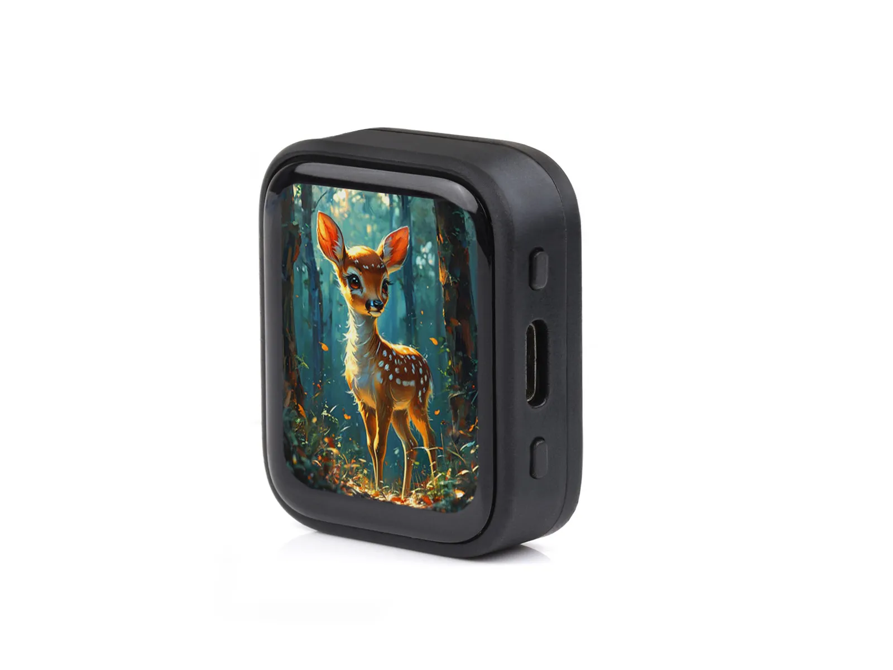

<div align="center">
  <h1>ESP32-S3-Touch-AMOLED-1.8</h1>
  <p><strong>ESP32-S3 1.8 英寸 368 x 448 QSPI AMOLED 触摸开发板</strong></p>
  <p>
    <a href="https://github.com/waveshareteam/ESP32-S3-Touch-AMOLED-1.8/actions/workflows/examples.yml"></a>
    <a href="https://components.espressif.com/components/waveshare/esp32_s3_touch_amoled_1_8"></a>
    <a href="LICENSE"></a>
  </p>
  <p>
    <a href="README.md">English</a> ·
    <a href="https://www.waveshare.com/esp32-s3-touch-amoled-1.8.htm">🌐 产品页面</a> ·
    <a href="https://docs.waveshare.com/ESP32-S3-Touch-AMOLED-1.8">📚 文档</a> ·
    <a href="https://github.com/waveshareteam/ESP32-S3-Touch-AMOLED-1.8/releases">📦 固件发布</a> ·
    <a href="examples/esp-idf/">🧩 ESP-IDF 示例</a> ·
    <a href="examples/README_ZH.md#arduino">🔧 Arduino 示例</a>
  </p>
  
</div>

---

## ✨ 概览

本仓库提供 Waveshare ESP32-S3-Touch-AMOLED-1.8 的第一方 ESP-IDF 工程、两套 Arduino 示例、源码构建固件包、工厂恢复镜像和开发文档。开发板集成 ESP32-S3、高分辨率 AMOLED 显示屏、电容触摸、电源管理、RTC、运动传感器、microSD 存储和音频接口，支持原版 SH8601/FT3168 与新版 CO5300/CST820 显示/触摸硬件。

## 🖥️ 硬件概览

| 功能 | 器件 / 接口 |
| --- | --- |
| MCU | ESP32-S3 |
| 显示 | 1.8 英寸 368 x 448 QSPI AMOLED |
| 原版显示 / 触摸 | SH8601 与 FT3168 电容触摸 |
| V2 显示 / 触摸 | CO5300 与 CST820 电容触摸 |
| 电源管理 | AXP2101 PMU |
| 实时时钟 | PCF85063A RTC |
| 运动传感器 | QMI8658 六轴 IMU |
| 音频 | ES8311 编解码器、板载麦克风输入和扬声器功放 |
| 存储 | 通过 SDMMC 的 microSD |
| 板级支持 | 托管组件：`waveshare/esp32_s3_touch_amoled_1_8` |

> [!NOTE]
> V2 板装配 CST820 触摸控制器。部分捆绑 Arduino 源码为兼容驱动而保留 `Arduino_CST816x` 系列或 API 标识；这些标识并不表示 V2 使用 CST816 芯片。

> [!IMPORTANT]
> 本仓库尚未包含板级原理图。CI 验证源码兼容性和固件打包，但不能替代对引脚、PSRAM、USB、显示、触摸、音频或传感器的硬件验证。

## 📦 固件工件

每次成功的 CI 构建都会打包为可刷写的固件归档，并上传到 [Build Examples 工作流](https://github.com/waveshareteam/ESP32-S3-Touch-AMOLED-1.8/actions/workflows/examples.yml)。发布版本可从 [GitHub Releases](https://github.com/waveshareteam/ESP32-S3-Touch-AMOLED-1.8/releases) 获取；近期提交的逐示例构建请使用 CI 工件。

```bash
python3 releases/download_artifacts.py --run-id <run-id> --clean
```

解压后在 `releases/downloads/run-<run-id>/` 的对应目录中刷写：

```bash
./flash.sh /dev/ttyACM0
```

Windows：

```bat
flash.bat COMx
```

每个包包含 `manifest.json`、`flash_args.txt`、平台刷写脚本和 `bin/` 下所需二进制文件；需要时使用 `python -m pip install esptool`。`Firmware/` 下的工厂与恢复镜像是仓库产品资产，并非 CI 构建输出；请参见[固件工件](docs/FIRMWARE_ZH.md)和[发布工具](releases/README_ZH.md)。

## 🧪 示例

### ESP-IDF

| 示例 | 重点 |
| --- | --- |
| [00_board_check](examples/esp-idf/00_board_check/) | 串口板级、内存、BSP 与能力检查 |
| [00_bsp_quickstart](examples/esp-idf/00_bsp_quickstart/) | 交互式显示、触摸、亮度和 SD 快速开始 |
| [01_project_template](examples/esp-idf/01_project_template/) | 最小托管 BSP 工程模板 |
| [02_hello_world](examples/esp-idf/02_hello_world/) | ESP-IDF 芯片信息和重启流程 |
| [03_nvs_counter](examples/esp-idf/03_nvs_counter/) | 持久化 NVS 启动计数器 |
| [04_freertos_tasks](examples/esp-idf/04_freertos_tasks/) | FreeRTOS 任务、队列与生产者/消费者流程 |
| [05_gpio_io](examples/esp-idf/05_gpio_io/) | 可配置 GPIO 回环 |
| [06_gpio_interrupt](examples/esp-idf/06_gpio_interrupt/) | GPIO 中断处理 |
| [08_i2c_tools](examples/esp-idf/08_i2c_tools/) | 板载 I2C 总线扫描器 |
| [09_sdmmc](examples/esp-idf/09_sdmmc/) | SDMMC 和 FAT 文件操作 |
| [10_wifi_station](examples/esp-idf/10_wifi_station/) | Wi-Fi station 连接 |
| [12_i2s_codec](examples/esp-idf/12_i2s_codec/) | ES8311 扬声器播放 |
| [13_display_colorbar](examples/esp-idf/13_display_colorbar/) | AMOLED RGB565 色条渲染 |
| [14_lvgl_demo_v9](examples/esp-idf/14_lvgl_demo_v9/) | LVGL 9 显示与触摸演示 |
| [90_axp2101_pmu](examples/esp-idf/90_axp2101_pmu/) | 底层 AXP2101 诊断 |
| [91_pcf85063_rtc](examples/esp-idf/91_pcf85063_rtc/) | PCF85063A RTC 诊断 |
| [92_qmi8658_imu](examples/esp-idf/92_qmi8658_imu/) | QMI8658 加速度和陀螺仪读数 |

先运行 `00_board_check` 进行串口检查，再使用 `00_bsp_quickstart` 进行首次显示和触摸交互测试。

### Arduino

Arduino 示例分为两套第一方集合，并携带各自匹配的捆绑库：

| 集合 | 显示 / 触摸 | 第一方草图 |
| --- | --- | ---: |
| [原版](examples/arduino/examples/) | SH8601 / FT3168 | 16 |
| [V2](examples/arduino-v2/examples/) | CO5300 / CST820 | 10 |

两套均覆盖显示初始化、绘图、RTC、LVGL、IMU、SD 和 ES8311 音频；原版还提供 Wi-Fi 分析、时钟、AXP2101 遥测、动画和 SquareLine 风格 LVGL 工程。捆绑库位于 [`examples/arduino/libraries`](examples/arduino/libraries/) 与 [`examples/arduino-v2/libraries`](examples/arduino-v2/libraries/)；其上游示例有意不纳入产品 CI 矩阵。请参见[示例](examples/README_ZH.md)和[示例指南](docs/EXAMPLES_GUIDE_ZH.md)。

## 🛠️ 支持的工具链

| 范围 | 版本 | 固件构建数 |
| --- | --- | ---: |
| ESP-IDF | `v5.5.5` | 17 |
| ESP-IDF | `v6.0.2` | 17 |
| Arduino-ESP32 原版 | `3.3.11` | 16 |
| Arduino-ESP32 V2 | `3.3.11` | 10 |

这些版本已于 2026-08-10 从官方稳定版发布重新核实。`Build Examples` 工作流运行两个发现作业和最多 60 个固件构建作业。拉取请求和分支推送构建受影响的第一方示例；工作流、发现和发布打包变更会重建两个框架表面。标签推送和手动 `all` 运行执行完整矩阵。每次成功构建上传源码构建固件工件；详见[持续集成](docs/CI_ZH.md)。

## 🗂️ 仓库布局

| 路径 | 用途 |
| --- | --- |
| [`examples/esp-idf/`](examples/esp-idf/) | 第一方 ESP-IDF 工程 |
| [`examples/arduino/`](examples/arduino/) | 原版 Arduino 草图和捆绑库 |
| [`examples/arduino-v2/`](examples/arduino-v2/) | V2 Arduino 草图和捆绑库 |
| [`Firmware/`](Firmware/) | 工厂刷写和恢复二进制文件 |
| [`releases/`](releases/) | 固件打包和工件下载工具 |
| [`config/`](config/) | 共享 ESP-IDF 配置说明和覆盖层 |
| [`docs/`](docs/) | 设置、示例、CI、结构和固件文档 |

## 📚 文档

- [产品页面](https://www.waveshare.com/esp32-s3-touch-amoled-1.8.htm)
- [官方产品文档](https://docs.waveshare.com/ESP32-S3-Touch-AMOLED-1.8)
- [入门](docs/GETTING_STARTED_ZH.md)
- [示例指南](docs/EXAMPLES_GUIDE_ZH.md)
- [仓库结构](docs/PROJECT_STRUCTURE_ZH.md)
- [持续集成](docs/CI_ZH.md)
- [固件工件](docs/FIRMWARE_ZH.md)
- [发布工具](releases/README_ZH.md)
- [English README](README.md)

## 🤝 支持和贡献

欢迎提交贡献和可复现的问题报告。请包含板卡修订、示例路径、框架版本、复现步骤、期望行为、实际行为，以及相关串口或构建日志。

- [贡献指南](CONTRIBUTING_ZH.md)
- [支持](SUPPORT_ZH.md)
- [安全策略](SECURITY_ZH.md)
- [行为准则](CODE_OF_CONDUCT_ZH.md)
- [第三方声明](THIRD_PARTY_ZH.md)
- [提交问题](https://github.com/waveshareteam/ESP32-S3-Touch-AMOLED-1.8/issues/new/choose)

## 📄 许可证

除非子目录另有说明，本仓库采用 Apache License 2.0。第三方库保留各自的许可证和声明；请参见 [LICENSE](LICENSE) 和[第三方声明](THIRD_PARTY_ZH.md)。
